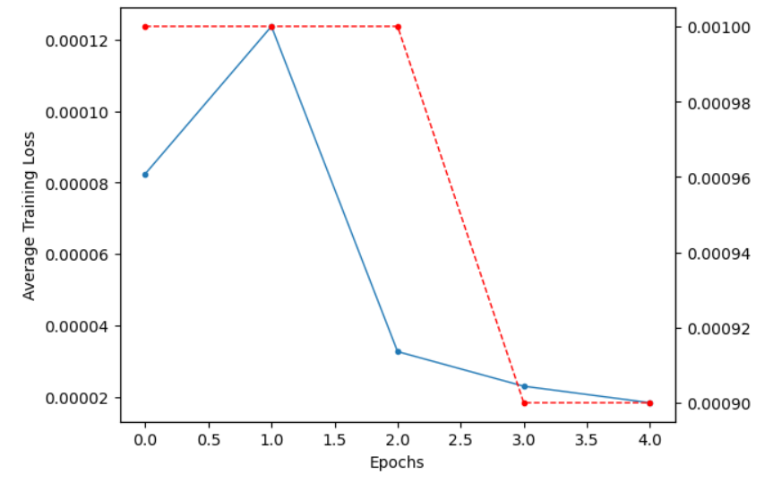
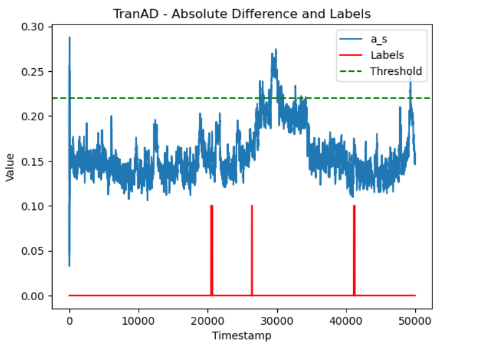
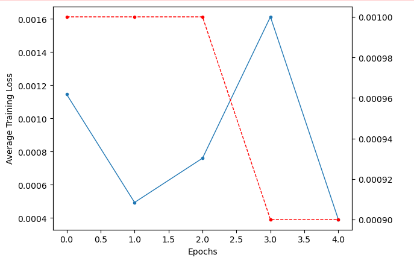
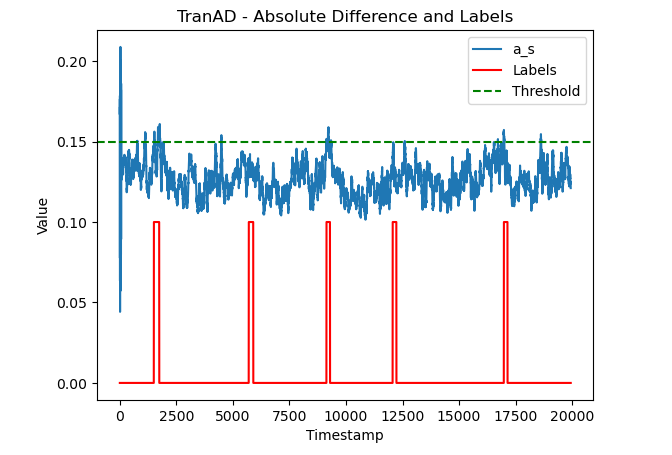

# 한국정보기술연구원 화이트햇 스쿨 2기 프로젝트 NeuralGurdians

# 프로젝트 개요

발전소 공정 데이터를 분석해 검증된 새로운 최신 모델을 접목하여 성능 평가를 하는 것이 목표입니다.

# 팀원 소개

## 멘토

- **박건호**
## 프로젝트 리더(PL)

-  **곽송이**

## 프로젝트 매니저(PM)

- **한준서**

## 팀원

- **김성광**
- **양호찬**
- **문서진**
- **한윤서**
- **정지현**

# 데이터셋 정보

https://github.com/icsdataset/hai

## 데이터셋 메뉴얼

https://github.com/icsdataset/hai/blob/master/hai_dataset_technical_details.pdf

# 관련 대회 정리

[# HAICon2021 산업제어시스템 보안위협 탐지 AI 경진대회](https://dacon.io/competitions/official/235757/overview/description)

# 일정

---

### 8월

- **8/1~8/7**: 성능평가에 사용할 새 모델 선정
- **8/8~8/14**: 기존 모델 성능 개선, 새 모델 훈련 과정 공부

# WBS

- 작업중
[https://docs.google.com/spreadsheets/d/12gPRNSC9bqZlqQibdWWhSHU-MFTciQ9hV2VQIW2A5ok/edit?usp=sharing]

# 프로젝트 고도화 일정

- 1회차 : 2024. 8. 7(수). 23시 59분까지  
- 2회차 : 2024. 8. 14(수). 23시 59분까지  
- 3회차 : 2024. 8. 21(수). 23시 59분까지  
- 4회차 : 2024. 8. 28(수). 23시 59분까지  
- 5회차 : 2024. 9 4(수). 23시 59분까지  
- 6회차 : 2024. 9. 11(수). 23시 59분까지
- 제출링크 : [https://forms.gle/vfej4Qm2U44nuR5t7](https://forms.gle/vfej4Qm2U44nuR5t7)

# 모델 학습

## TranAD

### 모델 훈련

#### 손실률, 학습률 그래프

#### 성능평가 그래프

- HAI 20.07 데이터셋 2만개 사용

#### F1스코어

**F1 Score: 0.971041948579161 
Precision: 0.9437138348237769 
Recall: 1.0 
Accuracy: 0.9946339017051153 
Confusion Matrix: 
18039   107 
 0          1794**

### 21년도 데이터 셋

#### 손실률, 학습률 그래프

#### 성능 평가 그래프

- HAI 21.03 데이터셋 2만개 사용

- **Accuracy Score: 0.983099297893681**
- **F1 Score: 0.9856825030175624**
- **Precision: 0.85**

### 22년도 데이터 셋

#### 손실률, 학습률 그래프

#### 성능 평가 그래프

### 23년도 데이터 셋

#### 손실률, 학습률 그래프

#### 성능 평가 그래프

## MTAD-GAT

## LSTM-Autoencoder

## Autoencoder

### 20년도 데이터 셋

#### 손실률, 학습률 그래프

#### 성능평가 그래프

#### F1스코어

**F1 Score: 0.739969 
Precision: 0.960922 
Recall: 0.601631 
Accuracy: 0.97 
Confusion Matrix: 
18318   39 
 635          959**

### 21년도 데이터 셋

#### 손실률, 학습률 그래프

#### 성능평가 그래프

#### F1스코어

**F1 Score: 0.611183 
Precision: 0.470942 
Recall: 0.870370 
Accuracy: 0.97 
Confusion Matrix: 
18882   529 
 71          469**

### 22년도 데이터 셋

#### 손실률, 학습률 그래프

#### 성능평가 그래프

#### F1스코어

**F1 Score: 0.61 
Precision: 0.47 
Recall: 0.87 
Accuracy: 0.97 
Confusion Matrix: 
18882   529 
 71          469**

## ResNet

### 20년도 데이터 셋

#### 성능 평가 그래프

#### F1스코어
- **F1 Score: 0.3503
- **Precision:  0.5582
- **Recall: 0.2552
- **Accuracy: 0.9484

### 21년도 데이터 셋

#### 손실률, 학습률 그래프

#### 성능 평가 그래프

- HAI 21.03 데이터셋 15만개 사용

#### F1스코어
- **F1 Score: 0.2747
- **Precision:  0.8641
- **Recall: 0.1633
- **Accuracy: 0.9751
- **Confusion Matrix:
390057 298  
9703 1894

